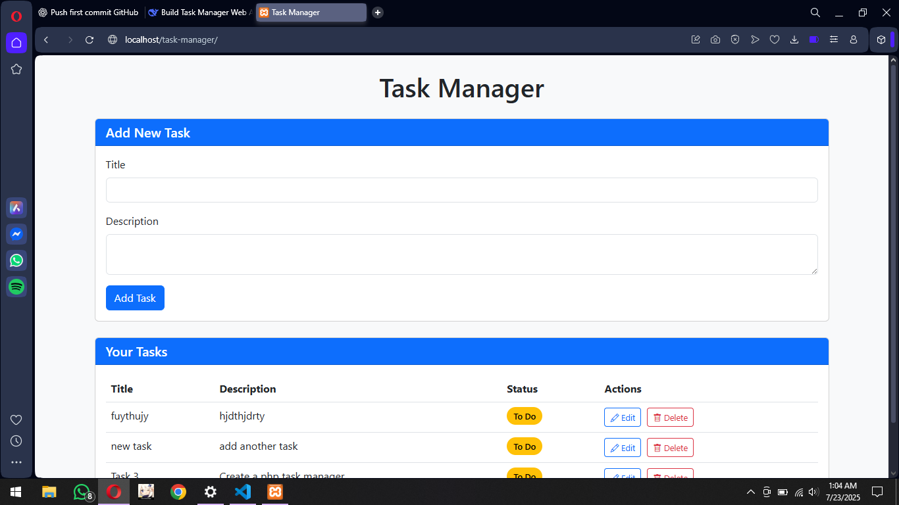
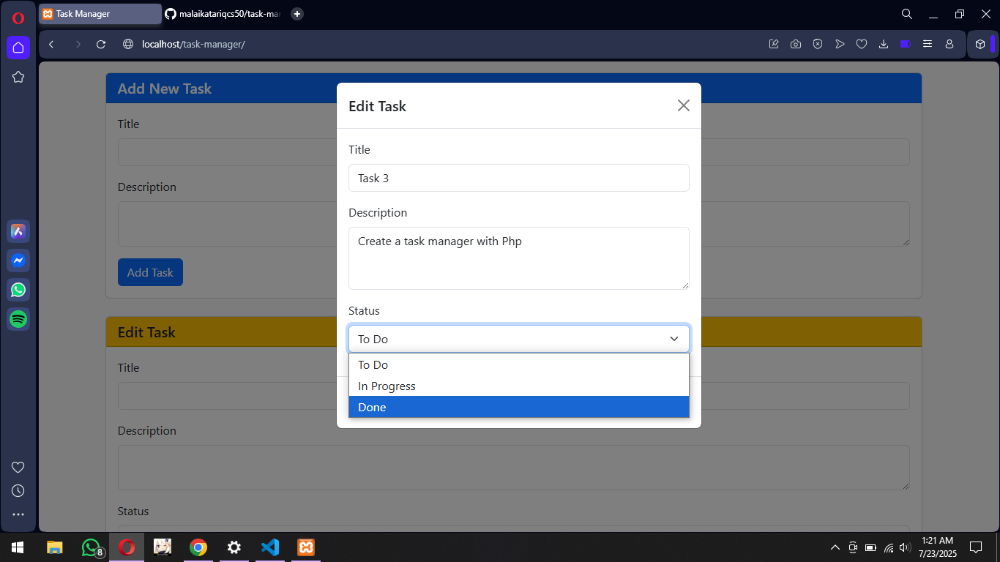
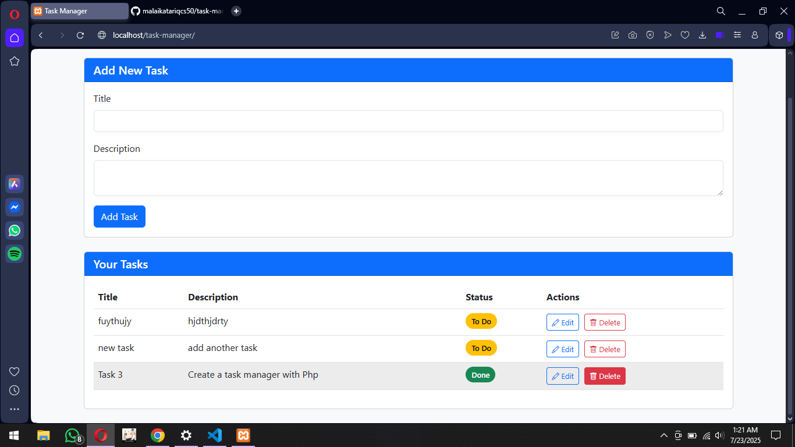

# 📝 Task Manager Web App

A lightweight task management system with drag-and-drop functionality and persistent storage.

## ✨ Features
- ✅ Create, edit, and delete tasks
- 🚦 Status tracking (To-Do/In Progress/Done)
- 👆 Drag-and-drop reordering
- 📱 Mobile-responsive design
- 💾 Persistent storage (JSON or MySQL)

## 🛠️ Tech Stack
- **Backend**: PHP 8+
- **Frontend**: HTML5, CSS3, JavaScript
- **UI Framework**: Bootstrap 5
- **Storage**: JSON file (or MySQL optional)

## 📸 Preview

